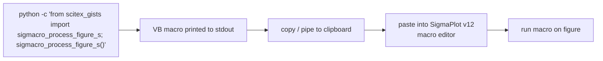

# scitex-gists

<p align="center">
  <a href="https://scitex.ai">
    
  </a>
</p>

<p align="center"><b>SigmaPlot macro printers — version-controlled VB-style macros emitted from Python.</b></p>

<p align="center">
  <a href="https://scitex-gists.readthedocs.io/">Full Documentation</a> · <code>uv pip install scitex-gists[all]</code>
</p>

<!-- scitex-badges:start -->
<p align="center">
  <a href="https://pypi.org/project/scitex-gists/"></a>
  <a href="https://pypi.org/project/scitex-gists/"></a>
  <a href="https://github.com/ywatanabe1989/scitex-gists/actions/workflows/rtd-sphinx-build-on-ubuntu-latest.yml"></a>
</p>
<p align="center">
  <a href="https://github.com/ywatanabe1989/scitex-gists/actions/workflows/pytest-matrix-on-ubuntu-py3-11-3-12-3-13.yml"></a>
  <a href="https://github.com/ywatanabe1989/scitex-gists/actions/workflows/import-smoke-on-ubuntu-py3-12.yml"></a>
  <a href="https://codecov.io/gh/ywatanabe1989/scitex-gists"></a>
</p>
<!-- scitex-badges:end -->

---

## Problem and Solution

| # | Problem | Solution |
|---|---------|----------|
| 1 | **SigmaPlot v12 macro files live outside version control** — one lab machine has them, nobody else does | **Python prints the macro** — `sigmacro_process_figure_s()` emits VB-style macro text; copy-paste into SigmaPlot editor; macros are now part of the repo |

## Installation

```bash
pip install scitex-gists
```

## Architecture

```
scitex_gists/
├── __init__.py
├── _SigMacro_processFigure_S.py  ← prints figure-processing VB macro
├── _SigMacro_toBlue.py           ← prints color-tweak VB macro
└── _skills/                      ← agent-facing skill pages
```

A two-function library: each `_SigMacro_*.py` module wraps a
multi-line VB-style macro string and a `print()` helper. Adding a new
macro = add a new `_SigMacro_<name>.py` and re-export from
`__init__.py`.

## 1 Interfaces

<details open>
<summary><strong>Python API</strong></summary>

<br>

```python
from scitex_gists import sigmacro_process_figure_s, sigmacro_to_blue

sigmacro_process_figure_s()
sigmacro_to_blue()
```

Each function prints VB-style macro text to stdout. Pipe into your
clipboard or redirect to a file, then paste into the SigmaPlot macro
editor.

</details>

## Demo



```bash
$ python -c "from scitex_gists import sigmacro_to_blue; sigmacro_to_blue()" | pbcopy
# now paste into the SigmaPlot macro editor and run
```

## Quick Start

```python
from scitex_gists import sigmacro_process_figure_s, sigmacro_to_blue

sigmacro_process_figure_s()   # prints the figure-processing macro
sigmacro_to_blue()            # prints the color macro
```

## Part of SciTeX

`scitex-gists` is part of [**SciTeX**](https://scitex.ai). Install via
the umbrella with `pip install scitex[gists]` to use as
`scitex.gists` (Python) or `scitex gists ...` (CLI).

>Four Freedoms for Research
>
>0. The freedom to **run** your research anywhere — your machine, your terms.
>1. The freedom to **study** how every step works — from raw data to final manuscript.
>2. The freedom to **redistribute** your workflows, not just your papers.
>3. The freedom to **modify** any module and share improvements with the community.
>
>AGPL-3.0 — because we believe research infrastructure deserves the same freedoms as the software it runs on.

## License

AGPL-3.0

---

<p align="center">
  <a href="https://scitex.ai" target="_blank"></a>
</p>
